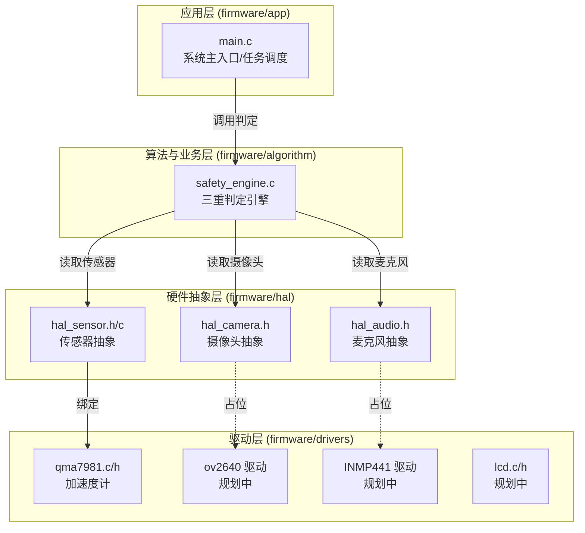
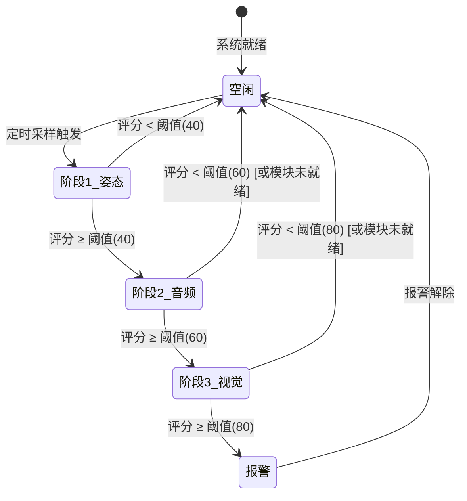

# BanSafe 系统架构文档

> 版本: 0.1.0 | 日期: 2026-05-13 | 状态: 草案（与当前代码对齐）

---

## 1. 概述

BanSafe 是一个基于 **ESP32-S3-EYE** 开发板的多传感器融合室内安全监控系统，通过视觉、音频、运动数据实现危险行为检测和报警。

---

## 2. 分层架构

软件严格遵循四层架构，依赖方向：**应用层 → 算法与业务层 → HAL ← 驱动层**。



> 虚线表示接口已定义但底层驱动尚未实现。

### 2.1 各层职责

| 层级 | 目录 | 职责 | 当前状态 |
|------|------|------|----------|
| 应用层 | `firmware/app/` | 系统主流程、任务创建、报警调度、通信管理 | **已实现** (main.c) |
| 算法与业务层 | `firmware/algorithm/` | 三重判定引擎、传感器融合、AI 推理 | **部分实现** (姿态检测已迁移) |
| HAL | `firmware/hal/` | 硬件无关接口，隔离驱动与上层 | **接口已定义** (hal_sensor 已实现) |
| 驱动层 | `firmware/drivers/` | 具体传感器/外设驱动 | **QMA7981 已迁移**，其余规划中 |

---

## 3. 数据流

### 3.1 完整数据流转

```
传感器 → 驱动层 (采集原始数据)
  → HAL (统一数据格式)
  → 算法层 (三重判定引擎)
  → 应用层 (报警决策/上报)
  → 报警输出 (云端/本地)
```

### 3.2 三重判定流程



### 3.3 当前实现状态

| 阶段 | 功能 | 状态 |
|------|------|------|
| 阶段 1 - 姿态检测 | 基于加速度矢量偏差评分 | ✅ 已实现 |
| 阶段 2 - 音频分析 | MFCC 特征 + TFLite 推理 | ❌ 规划中（占位返回 -1） |
| 阶段 3 - 视觉分析 | TFLite Micro 推理 | ❌ 规划中（占位返回 -1） |

---

## 4. 目录结构

```
firmware/
├── app/
│   └── main.c                  # 应用主入口
├── algorithm/
│   ├── safety_engine.h         # 三重判定引擎接口
│   └── safety_engine.c         # 三重判定引擎实现
├── hal/
│   ├── hal_sensor.h            # 传感器 HAL 接口
│   ├── hal_sensor.c            # 传感器 HAL 实现（→ QMA7981）
│   ├── hal_camera.h            # 摄像头 HAL 接口
│   └── hal_audio.h             # 麦克风 HAL 接口
├── drivers/
│   ├── sensors/
│   │   ├── qma7981.h           # QMA7981 驱动
│   │   └── qma7981.c
│   ├── camera/
│   │   └── (ov2640 驱动 规划中)
│   └── display/
│       └── (lcd 驱动 规划中)
├── models/                     # TFLite 模型文件（规划中）
│   └── (存放 .tflite 文件)
└── CMakeLists.txt              # ESP-IDF 构建配置（待适配）
```

---

## 5. 关键设计决策

| 决策 | 说明 | 记录 |
|------|------|------|
| 分层隔离 | 算法层只调用 HAL，不直接访问驱动 | [ADR-001](decisions/adr_001_layered_architecture.md) |
| 三重"与"逻辑 | 只有全部通过才报警，减少误报 | [ADR-002](decisions/adr_002_triple_engine.md) |
| HAL 占位模式 | 未就绪模块返回 ESP_ERR_NOT_SUPPORTED，不阻塞启动 | 本文档 |

---

## 6. 后续规划

1. **Wi-Fi 通信** — 完善 communication_task，实现 MQTT 数据上报
2. **音频驱动** — 完成 INMP441 I2S 驱动及 HAL 实现
3. **摄像头驱动** — 完成 OV2640 驱动及 HAL 实现
4. **AI 模型** — 训练并部署 TFLite Micro 模型到 `firmware/models/`
5. **BLE 定位** — 在通信任务中实现 BLE RSSI 室内定位
6. **OTA 升级** — 集成 ESP-IDF OTA 组件